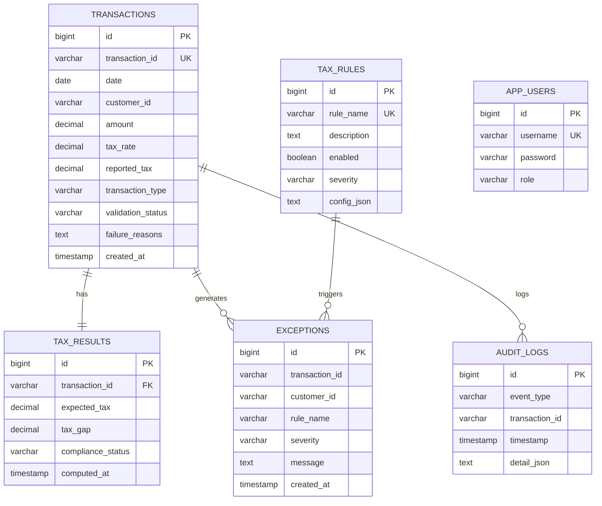

# Tax Gap Detection & Compliance Validation Service

A Spring Boot backend service for tax auditors to detect tax gaps, validate financial transactions, run configurable rule-based compliance checks, and generate audit trails and summary reports.

---

## Tech Stack

| Layer | Technology |
|-------|-----------|
| Language | Java 17 |
| Framework | Spring Boot 3.2 |
| Security | Spring Security + JWT |
| ORM | JPA / Hibernate |
| Database | MySQL 8.x |
| Migrations | Flyway |
| Build | Maven |
| Coverage | JaCoCo |

---

## Project Structure

```
src/main/java/com/taxgap/
├── controller/         TransactionController, ExceptionController,
│                       ReportController, AuditController, AuthController
├── service/            TransactionService, ExceptionService,
│                       ReportService, AuditService
├── engine/             ValidationEngine, TaxGapCalculator, RuleEngine
│   └── rules/          HighValueTransactionRule, RefundValidationRule,
│                       GstSlabViolationRule
├── domain/
│   ├── entity/         Transaction, TaxResult, TaxRule, TaxException,
│   │                   AuditLog, AppUser
│   └── enums/          TransactionType, ValidationStatus, ComplianceStatus,
│                       Severity, EventType
├── repository/         JPA repositories for all entities
├── dto/
│   ├── request/        BatchTransactionRequest, TransactionRequest, LoginRequest
│   └── response/       BatchUploadResponse, TransactionResponse,
│                       ExceptionResponse, CustomerTaxSummary,
│                       ExceptionSummaryReport, JwtResponse, AuditLogResponse
├── security/           JwtUtils, JwtAuthFilter, UserDetailsServiceImpl
├── config/             SecurityConfig
└── exception/          GlobalExceptionHandler
```

---

## Database Schema



---

## Database Setup (MySQL)

**1. Create the database**
```sql
CREATE DATABASE taxgapdb CHARACTER SET utf8mb4 COLLATE utf8mb4_unicode_ci;
```

**2. Update credentials in `application.properties`**
```properties
spring.datasource.url=jdbc:mysql://localhost:3306/taxgapdb?useSSL=false&serverTimezone=UTC&allowPublicKeyRetrieval=true
spring.datasource.username=root
spring.datasource.password=your_password
```

**3. Run the application**

Flyway automatically runs `V1__init_schema.sql` on first startup — creating all tables and seeding:
- Two users: `admin` (`ROLE_ADMIN`) and `auditor` (`ROLE_AUDITOR`), both with password `password`
- Three tax rules: `HIGH_VALUE_TRANSACTION`, `REFUND_VALIDATION`, `GST_SLAB_VIOLATION`

---

## How to Run

```bash
# Clone the repo
git clone <your-repo-url>
cd tax-gap-service

# Build
mvn clean package -DskipTests

# Run
java -jar target/tax-gap-service-1.0.0.jar
```

Or via Maven:
```bash
mvn spring-boot:run
```

App starts on `http://localhost:8080`

---

## Running Tests & Coverage

```bash
# Run all tests and generate JaCoCo report
mvn clean test

# View coverage report
open target/site/jacoco/index.html
```

---

## API Reference

### Authentication

All endpoints (except `/api/auth/login`) require a Bearer JWT token.

#### Login
```http
POST /api/auth/login
Content-Type: application/json
```
```json
{
  "username": "auditor",
  "password": "password"
}
```

Response:
```json
{
  "token": "eyJhbGciOiJIUzI1NiJ9...",
  "username": "auditor",
  "role": "ROLE_AUDITOR"
}
```

Use the token in all subsequent requests:
```
Authorization: Bearer <token>
```

---

### Transaction Upload

#### Upload a batch of transactions
```http
POST /api/transactions/batch
Authorization: Bearer <token>
Content-Type: application/json
```
```json
{
  "transactions": [
    {
      "transactionId": "TXN-001",
      "date": "2024-03-15",
      "customerId": "CUST-001",
      "amount": 50000.00,
      "taxRate": 0.18,
      "reportedTax": 9000.00,
      "transactionType": "SALE"
    },
    {
      "transactionId": "TXN-002",
      "date": "2024-03-15",
      "customerId": "CUST-001",
      "amount": 150000.00,
      "taxRate": 0.05,
      "reportedTax": 5000.00,
      "transactionType": "SALE"
    },
    {
      "transactionId": "TXN-003",
      "date": "2024-03-16",
      "customerId": "CUST-002",
      "amount": 75000.00,
      "taxRate": 0.18,
      "reportedTax": 8000.00,
      "transactionType": "REFUND"
    }
  ]
}
```

#### Get all transactions
```http
GET /api/transactions
Authorization: Bearer <token>
```

#### Get single transaction
```http
GET /api/transactions/{transactionId}
Authorization: Bearer <token>
```

---

### Exceptions

```http
# All exceptions
GET /api/exceptions
Authorization: Bearer <token>

# Filter by customer
GET /api/exceptions?customerId=CUST-001

# Filter by severity
GET /api/exceptions?severity=HIGH

# Filter by rule name
GET /api/exceptions?ruleName=GST_SLAB_VIOLATION

# Combined filter
GET /api/exceptions?customerId=CUST-001&severity=HIGH
```

---

### Reports

```http
# Customer tax summary (complianceScore, totalTaxGap, etc.)
GET /api/reports/customer-summary
Authorization: Bearer <token>

# Exception summary (counts by severity and customer)
GET /api/reports/exception-summary
Authorization: Bearer <token>
```

---

### Audit Logs

```http
# All audit logs
GET /api/audit
Authorization: Bearer <token>

# Audit logs for a specific transaction
GET /api/audit/{transactionId}
Authorization: Bearer <token>
```

---

## Tax Gap Logic

```
expectedTax = amount × taxRate
taxGap      = expectedTax − reportedTax

|taxGap| ≤ 1  →  COMPLIANT
taxGap  > 1   →  UNDERPAID
taxGap  < −1  →  OVERPAID
reportedTax missing  →  NON_COMPLIANT
```

---

## Compliance Rules

| Rule | Trigger Condition | Severity |
|------|-------------------|----------|
| `HIGH_VALUE_TRANSACTION` | `amount > 100,000` | HIGH |
| `REFUND_VALIDATION` | REFUND `amount > 50,000` | MEDIUM |
| `GST_SLAB_VIOLATION` | `amount > 10,000` AND `taxRate < 0.18` | HIGH |

Rules are stored in the `tax_rules` table with a JSON config column. They can be **enabled or disabled without redeployment** by updating the `enabled` flag in the database. Adding a new rule requires: (1) implementing `TaxRuleExecutor`, and (2) inserting a row in `tax_rules`.

---

## Security

- JWT-based stateless authentication (no sessions)
- Roles: `ROLE_ADMIN` (full access including rule management), `ROLE_AUDITOR` (read + upload)
- Passwords are BCrypt hashed in the database

---

## Architecture

```
Client
  │
  ▼
Controller Layer       ← REST endpoints, request/response mapping
  │
  ▼
Service Layer          ← Business orchestration, transaction management
  │
  ├──► ValidationEngine    ← Field-level validation
  ├──► TaxGapCalculator    ← Pure tax math (no DB calls)
  ├──► RuleEngine          ← Loads active rules from DB, runs all executors
  └──► AuditService        ← Writes audit trail for every step
  │
  ▼
Repository Layer       ← JPA / Hibernate, Spring Data
  │
  ▼
MySQL Database
```
